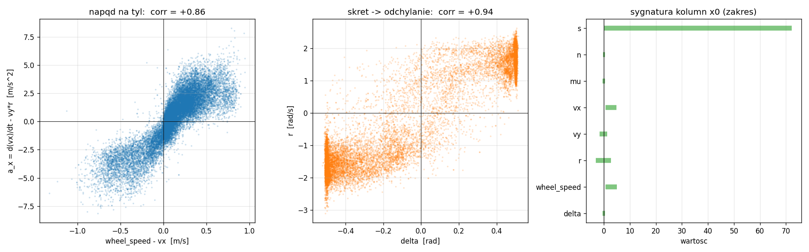
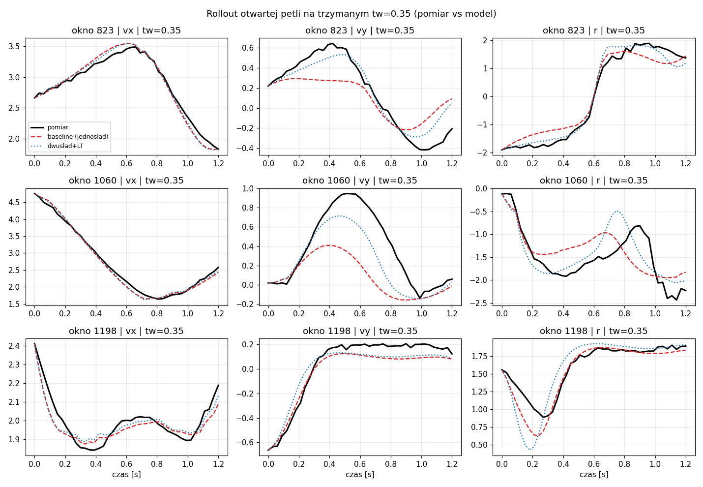
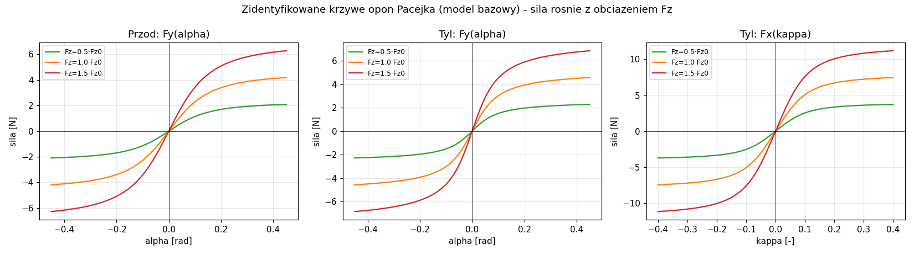
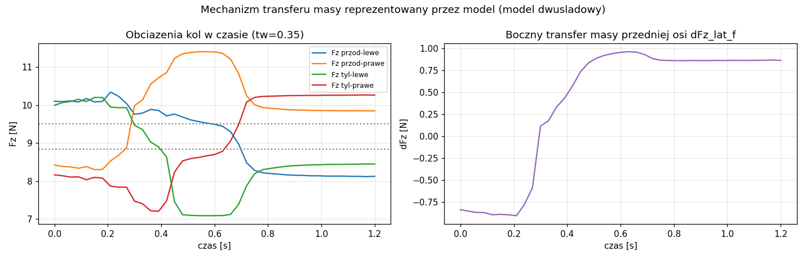
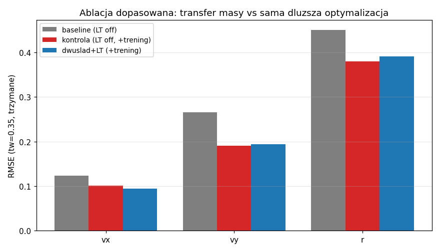

<h2>
Przedmiot: Teoria sterowanie w robotyce

Prowadzący: Jan Węgrzynowski

Autor: inż. Julian Mikołajczak</h2>

# Model dwuśladowy samochodu z transferem masy i oponami Pacejka

Różniczkowalny (PyTorch) model dynamiki samochodu **dwuśladowego** (4 koła) z podłużnym
i poprzecznym **transferem masy** oraz oponami **Pacejka** (Magic Formula), wraz z
gradientową **identyfikacją** parametrów z danych symulatora F1Tenth.


## Struktura repozytorium

| Plik | Rola |
|---|---|
| `vehicle_model.py` | różniczkowalny `torch.nn.Module` — model dwuśladowy (§Jak działa) |
| `dataset_reader_sens.py` | wczytanie i weryfikacja semantyki danych `.npz` (`--inspect`) |
| `data.py` | budowa okien train/val, filtrowanie, podział wg `tw` |
| `identify.py` | gradientowa identyfikacja parametrów (etapowy trening Adam) |
| `validate.py` | metryki (R², RMSE) + generowanie wykresów do `figures/` |
| `config.py` | stałe geometryczno-bezwładnościowe i hiperparametry |
| `dataset/` | 22 pliki `.npz` (F1Tenth, przejazdy MPC) |
| `results/` | checkpointy `*.pt` (po jednym na wariant modelu) |
| `figures/` | wykresy `*.png` |

## Instalacja

```bash
pip install -r requirements.txt       
```

## Uruchomienie

```bash
python dataset_reader_sens.py --inspect figures/fig_data_semantics.png  # weryfikacja semantyki danych
python identify.py                  # model bazowy (jednoślad) -> results/params_baseline.pt
python diagnostic.py                # diagnostyka identyfikowalności transferu masy
python identify.py --load-transfer  # dotrenowanie mu2 (mu2_only + joint_lt)
python identify.py --control        # kontrola dopasowana (LT off, dłuższy trening)
python identify.py --bfz            # alternatywny mechanizm B(Fz)
python validate.py                  # metryki + wykresy (figures/)
```


## Dane

- **22 pliki `.npz`** z symulatora F1Tenth (regulator MPC), 1000 kroków × `dt ≈ 0.03 s`.
- Surowa macierz `x0 (T, 8)` **bez etykiet** → semantykę przypisano z pochodzenia danych
  i potwierdzono statystycznie (`--inspect`): stan `[s, n, mu, vx, vy, r]`, sterowanie
  `[wheel_speed, delta]`. `a_x` liczone różnicą skończoną ze `vx` (z członem `−vy·r`).
- **Rozstaw kół `tw` ∈ {0.25…0.50} m** przemiatany po plikach → dźwignia transferu masy
  (poprzeczny transfer ∝ `1/tw`).
- **Split wg `tw`**: walidacja = trzymane `tw = 0.35` (test interpolacyjny). 5635 okien
  treningowych / 1266 walidacyjnych.



## Jak działa model

Różniczkowalny `torch.nn.Module` (`vehicle_model.py`). Stan dynamiczny **`[vx, vy, r]`**
w układzie nadwozia (pozycji `[s, n, mu]` nie całkujemy — brak krzywizny toru i niepotrzebne).

1. **Poślizgi** — slip ratio `κ_r` (napęd na tył) i kąty znoszenia `α_f, α_r`.
2. **Opony Pacejka** — `F = D·sin(C·atan(B·s − E·(B·s − atan(B·s))))`, gdzie
   `D = μ(Fz)·Fz`, `μ(Fz) = μ0 + μ2·(Fz − Fz0)`. Nachylenie początkowe = `B·C·D`, szczyt = `D`.
3. **Transfer masy** — `ΔFz_long = ΣFx·h/L`, `ΔFz_lat = Fy·h/tw`; `Fz` koła = statyczne
   ± poprawki, obcięte ≥ 0. Liczony z **siły właściwej `ΣF/m`**, nie z `v̇`.
4. **Elipsa tarcia** — sprzężenie wzdłuż/bok na osi napędzanej: `(Fx/Dx)² + (Fy/Dy)² ≤ 1`.
5. **Równania ruchu** — `v̇x = ΣFx/m + vy·r`, `v̇y = ΣFy/m − vx·r`, `ṙ = Mz/Iz`;
   `Mz = lf·Fy_f − lr·Fy_r + (tw/2)·(Fx_rr − Fx_rl)` (ostatni człon = efekt dwuśladu).
6. **Całkowanie RK4**, ZOH na kroku, w pełni różniczkowalne (autodiff przez cały rollout).

## Kluczowe decyzje projektowe

- **Transfer z siły właściwej `ΣF/m`, nie z `v̇`** — w ustalonym zakręcie `v̇y ≈ 0`, ale
  `a_y = v̇y + vx·r` jest duże (człon dośrodkowy); liczenie z `v̇y` wyzerowałoby transfer
  tam, gdzie jest największy.
- **`μ2` to jedyny pomost transfer↔dynamika** — bez `μ2 ≠ 0` model dwuśladowy redukuje się
  **dokładnie** do jednośladu (człony liniowe w `ΔFz` kasują się; efekt jest **drugorzędowy**,
  ∝ `ΔFz²` ∝ `1/tw²`) → stąd przemiatanie `tw` jako dźwigni identyfikowalności.
- **Stałe geometryczne ustalone** (nie identyfikowane) — obserwujemy tylko `F/m`, w którym
  `m` degeneruje się z `μ0`, a `h_cg` z `μ2` (dane wiążą tylko iloczyn `μ2·h_cg²`). Liczą się
  proporcja `lf:lr`, skala `Iz` i `μ2·h_cg²`.
- **Identyfikacja gradientowa, etapowa** (`identify.py`, Adam): (1) wzdłużny → (2) boczny/
  odchylanie → (3) łączny — rozprzęga źle uwarunkowane kierunki. Strata = błąd wieloskokowego
  rolloutu otwartej pętli, ważony `1/std` kanału. Parametry dodatnie przez `softplus`.

## Wyniki — model bazowy (jednoślad, `μ2 = 0`)

Parametry Pacejki fizycznie sensowne (B > 0, C ∈ 0.7–0.95, μ0 ∈ 0.5–1.0).
Pełny rollout 40 kroków (≈ 1.2 s):

| | vx | vy | r |
|---|---|---|---|
| TRAIN R² | 0.978 | 0.582 | 0.940 |
| VAL (tw=0.35) R² | 0.982 | 0.612 | 0.936 |

`vx` i `r` odtwarzane bardzo dobrze. Jak można zauważyć **`vy` to kanał najtrudniejszy** (R² ≈ 0.6) — mały,
wrażliwy na strukturę modelu, akumuluje błąd w otwartej pętli 
Bliskość train/val → brak przeuczenia.





Sam model pozostaje pełnym **dwuśladem**: po włączeniu `load_transfer` ten sam zestaw
parametrów reprezentuje redystrybucję obciążeń pionowych między koła (zewnętrzne dociążają
się, wewnętrzne odciążają; transfer przedniej osi `≈ ±0.9 N` przy `tw = 0.35`).



### Zidentyfikowane parametry Pacejki (model bazowy)

| opona (`s`) | B | C | μ0 | μ2 | E |
|---|---|---|---|---|---|
| przednia, boczna (`α`) | 6.72 | 0.818 | 0.513 | 0 | −0.076 |
| tylna, boczna (`α`) | 9.12 | 0.920 | 0.583 | 0 | 0.587 |
| tylna, wzdłużna (`κ`) | 10.03 | 0.725 | 0.996 | 0 | −0.579 |

Opory: `Cr0 = 0.009`,
`Cr_v = 0.040`, `Cd = 0.093`.

## Ablacja — czy transfer masy poprawia predykcję? (kluczowy wynik)

Dopasowana ablacja na trzymanym `tw = 0.35`:

| model | mechanizm | VAL R² [vx, vy, r] |
|---|---|---|
| baseline | jednoślad | [0.982, **0.612**, 0.936] |
| kontrola | jednoślad, dłuższy trening | [0.982, **0.708**, 0.944] |
| mu2_only | dotrenowanie tylko `μ2` (trenuje tylko f_mu2, r_mu2, x_mu2) | [0.982, **0.590**, 0.936] |
| joint_lt | pełny dotrenowanie z transferem masy | [0.984, **0.697**, 0.941] |
| bfz | czułość sztywności `B(Fz)` (1. rzędu) | [0.982, **0.574**, 0.933] |



**Wniosek:** model z transferem (`joint_lt`, 0.697) **nie przewyższa** dopasowanej kontroli
bez transferu (`kontrola`, 0.708) — cała poprawa `vy` pochodzi z dłuższej optymalizacji,
nie z transferu. Izolacja `mu2_only` nie poprawia (0.590 ≈ 0.612, w szumie). Mechanizm
pierwszorzędowy `B(Fz)` też zawodzi (gorszy, niestabilne `B1`).

**Sygnatura nieidentyfikowalności:** `μ2 < 0` (fizyczne) przy zamrożonej bazie, ale `μ2 > 0`
(niefizyczne) przy bazie wolnej — zmiana znaku zależnie od reszty parametrów = degeneracja
`μ2` z parametrami opon. 

## Podsumowanie

1. Zaimplementowano różniczkowalny dwuślad (4 koła, oba transfery, Pacejka z load-zależnym
   szczytem i elipsą tarcia). Bazowy model odtwarza `vx`/`r` bardzo dobrze (R² ≈ 0.98/0.94).
2. **Transfer masy widoczny co do znaku, ale nierozdzielnie identyfikowalny** — efekt
   (~1–2 % siły bocznej) tonie pod progiem błędu `vy` (~30–40 % wariancji). To nie dowód
   braku transferu, lecz braku jego *rozdzielności* spod błędu modelu.
3. **Co by pomogło**: niższy próg błędu w `vy` (relaksacja opony, rezygnacja z `Fx_f = 0`),
   dane z większym `a_y` i silniejszym przemiataniem `tw`, lub estymacja w pętli zamkniętej.

---